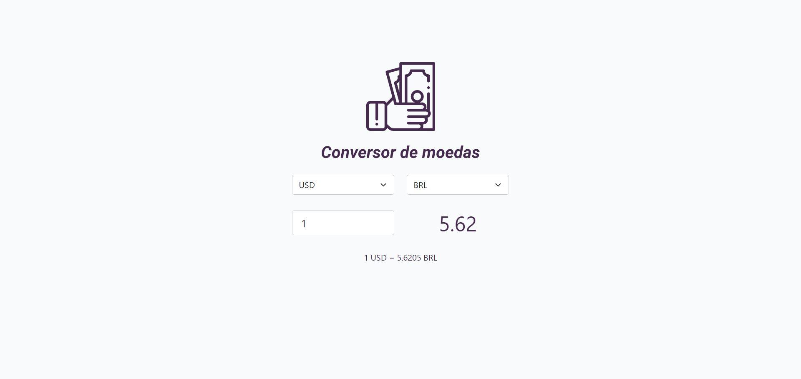

<h1 align="center">

    <br>Currency Converter<br/>
    JavaScript | ExchangeRate-API
</h1>

<p align="center">
    
    
    
    <br/>
</p>

<p align="center">
    <a href="#bookmark-sobre-o-projeto">Sobre</a>&nbsp;&nbsp;&nbsp;|&nbsp;&nbsp;&nbsp;
    <a href="#rocket-tecnologia-utilizada">Tecnologia</a>&nbsp;&nbsp;&nbsp;|&nbsp;&nbsp;&nbsp;
    <a href="#boom-como-executar">Como Executar</a>&nbsp;&nbsp;&nbsp;|&nbsp;&nbsp;&nbsp;
    <a href="#memo-licença">Licença</a>
</p>

<p align="center">
    
<p>

## :bookmark: Sobre o Projeto

O **Currency Converter** é uma aplicação Web com o intuito de realizar a conversão de moedas do mundo inteiro.

Idealizado como proposta de ensino para estudantes de JavaScript.

## :rocket: Tecnologia Utilizada

- [ExchangeRate-API](https://www.exchangerate-api.com/)

## :boom: Como Executar

- ### **Pré-requisito**

  - É **necessário** possuir uma conta na **[ExchangeRate-API](https://www.exchangerate-api.com/)** para conseguir ter acesso a uma API Key e assim realizar as requisições para a API com sucesso.

1. Faça um clone do repositório:

```sh
  $ git clone https://github.com/DanielAraldi/currency-converter.git
```

2. Executando a Aplicação:

- Executar o arquivo [HTML](index.html) no Browser (Navegador).

## :memo: Licença

Esse projeto está sob a licença MIT. Veja o arquivo [LICENSE](LICENSE) para mais detalhes.

---

<sup>Projeto desenvolvido com a tutoria de [Roger Melo](https://github.com/Roger-Melo).</sup>
